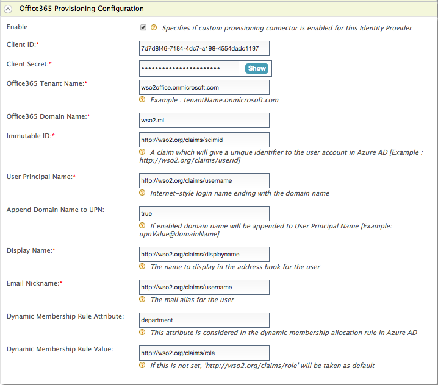
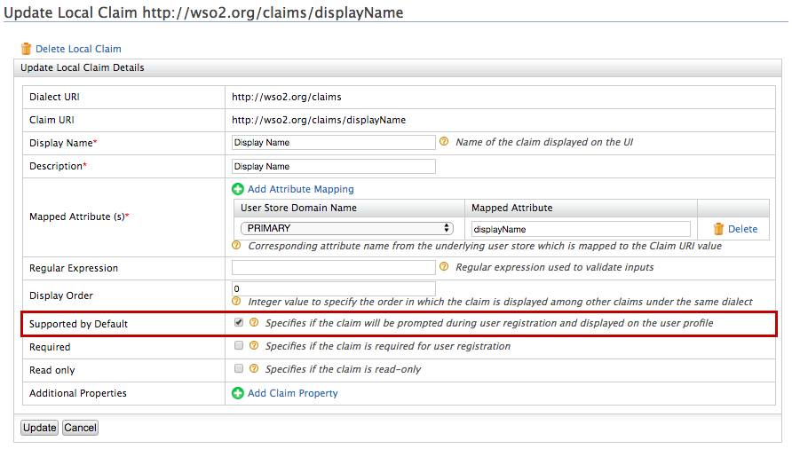
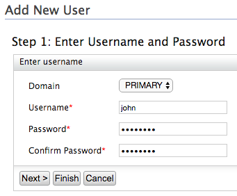
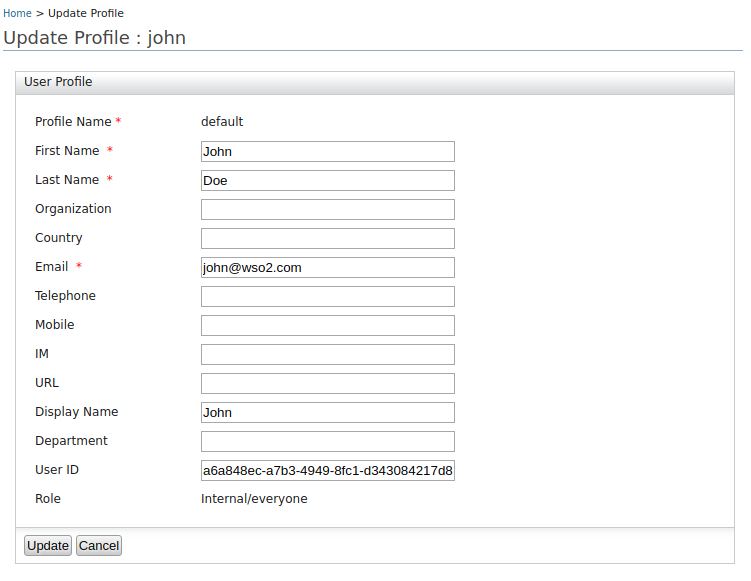
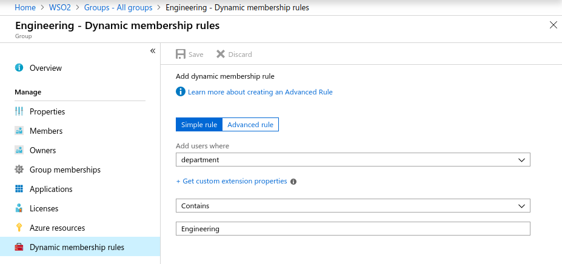
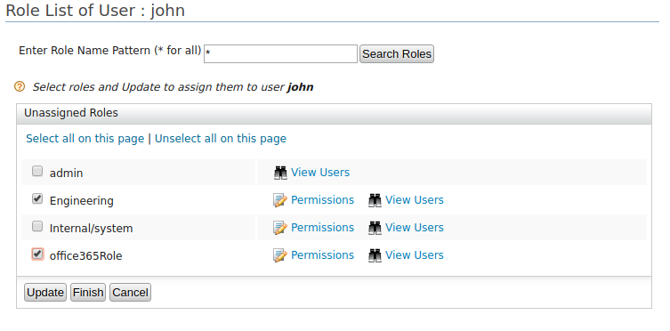

# Configuring Microsoft Azure AD Outbound Provisioning Connector

The Microsoft Azure AD authenticator is configured as a federated authenticator in WSO2 Identity Server to authenticate Office365 users to
log in to your organization’s applications using OpenID Connect.
Office365 refers to subscription plans that include access to Office
applications plus other productivity services that are enabled over the
Internet (cloud services).

The diagram below illustrates the flow of the Office365 federated
authenticator.

  

This document provides instructions on how to provision users to a Azure
Active Directory (Azure AD) from the WSO2 Identity Server (WSO2 IS).
Follow the instructions given in the sections below to set this up.

This connector allows the users to be:

-   provisioned to the Azure AD

-   deprovisioned from the Azure AD

-   assigned to groups in the Azure AD

### Prerequisites

Before you begin:

-   Register a new application using the [Microsoft App Registration
    Portal](https://apps.dev.microsoft.com/). For instructions on how
    to do this, see [Registering an
    application](https://developer.microsoft.com/en-us/graph/docs/concepts/auth_register_app_v2)
    in the Microsoft documentation. 
    
    <details>
      <summary>Click to view vital information about registering the application</summary>
      <p> 
      
      When registering the application, note the following mandatory
      configurations.

      1.  Under the **Platforms** section, select **Allow Implicit flow**
          and configure the redirect and logout URLs.

      2.  Under the **Microsoft Graph Permissions** section, add the
          following permissions.

          1.  Delegated permissions:
              -   User.Read
              -   User.ReadBasic.All
              -   User.ReadWrite
              -   User.Invite.All (Admin Only)
              -   User.Read.All (Admin Only)
              -   User.ReadWrite.All (Admin Only)

          2.  Application permissions:
              -   Directory.Read.All (Admin Only)
              -   Domain.ReadWrite.All (Admin Only)
              -   User.Read.All (Admin Only)
              -   User.ReadWrite.All (Admin Only)

      3.  Application permissions needs to be [consented by an
          administrator](https://docs.microsoft.com/en-us/azure/active-directory/develop/active-directory-v2-scopes#requesting-consent-for-an-entire-tenant)
          . Construct and access the following URL on a browser window to
          provide consent for the application permissions.

          **Request URL Format**

          ``` java
          https://login.microsoftonline.com/{tenant}/adminconsent?client_id={application-is}&state=12345&redirect_uri={application-redirect-url}
          ```

          **Sample URL**

          ``` java
                  https://login.microsoftonline.com/wso2sl.onmicrosoft.com/adminconsent?client_id=1b0c61c1-3af9-41f6-a7a7-e5f1e4ac1023&state=12345&redirect_uri=https://localhost/myapp
          ```
      </p>
    </details>

-   Add a new domain to Office 365 using the [Office 365 Admin
    Portal](https://portal.office.com/adminportal/home). For
    instructions on how to do this, see [Add A Domain to Office
    365](https://support.office.com/en-us/article/add-a-domain-to-office-365-6383f56d-3d09-4dcb-9b41-b5f5a5efd611)
    in the Microsoft documentation.

### Installing the connector

1.  Download the [Office365 connector from the WSO2 Connectors
    Store](https://store.wso2.com/store/assets/isconnector/details/5b67b248-fa00-4178-bf16-5606876ace4b).

2.  Copy the
    `           org.wso2.carbon.identity.outbound.provisioning.connector.office365-x.x.x.jar          `
    file to the
    `           <IS_HOME>/repository/components/dropins          `
    folder.

3.  Restart the server.

### Configuring the identity provider

First you must configure an identity provider to accept the provisioning
request from WSO2 Identity Server. Follow the instructions given below
to create a new identity provider for Office365 provisioning in WSO2 IS.

1.  Log in to the management console using your username and password or
    admin/admin credentials.

2.  Click **Add** under **Identity Providers** on the **Main** menu.

3.  Enter a name for the identity provider.

4.  Expand **Outbound Provisioning Connectors** and then expand
    **Office365 Provisioning Configuration.**
5.  Configure the following fields.

    

    <table>
    <thead>
    <tr class="header">
    <th>Field</th>
    <th>Description</th>
    <th>Sample Value</th>
    </tr>
    </thead>
    <tbody>
    <tr class="odd">
    <td>Enable</td>
    <td>Select the checkbox to enable Office365 identity provisioning. Unselect the checkbox to disable it.</td>
    <td>Selected</td>
    </tr>
    <tr class="even">
    <td>Client ID</td>
    <td>The application ID used to register the app in the <a href="https://apps.dev.microsoft.com/">Microsoft App Registration Portal<br />
    </a> (see the prerequisites for more information).</td>
    <td>7d7d8f46-7184-4dc7-a198-4554dadc1197</td>
    </tr>
    <tr class="odd">
    <td>Client Secret</td>
    <td>The application secret used to register the app in the <a href="https://apps.dev.microsoft.com/">Microsoft App Registration Portal</a><br />
    (see the prerequisites for more information).</td>
    <td><br />
    </td>
    </tr>
    <tr class="even">
    <td>Office365 Tenant Name</td>
    <td>The organization name used to signup for Office 365.</td>
    <td>wso2office.onmicrosoft.com</td>
    </tr>
    <tr class="odd">
    <td>Office365 Domain Name</td>
    <td>The domain name registered in Office365 (see the <a href="#prerequisites">prerequisites</a> for more information).</td>
    <td>wso2.ml</td>
    </tr>
    <tr class="even">
    <td>Immutable ID</td>
    <td><div class="content-wrapper">
    <p>A valid claim which acts as the unique identifier of the user in the Azure AD.</p>
    <p>:clipboard:<strong>Note:</strong> The claim URI for the Immutable ID should match the Subject Claim URI given under the Claim Configuration section when creating a service provider.</p>
    </div></td>
    <td>http://wso2.org/claims/objectguid</td>
    </tr>
    <tr class="odd">
    <td><p>User Principal Name</p></td>
    <td><p>A valid claim which will be the Internet-style login name for the user.</p></td>
    <td><p>http://wso2.org/claims/username</p></td>
    </tr>
    <tr class="even">
    <td><p>Append Domain Name to UPN</p></td>
    <td><p>If this is set to <strong>true</strong>, the domain name is appended to the UPN if it is not already there.</p></td>
    <td><p>true</p>
    <br />

    <p>(E.g., if the username is "john" and the domain name is "foo.com",<br />
    the UPN will be " <strong>john@foo.com</strong> ")</p></td>
    </tr>
    <tr class="odd">
    <td><p>Display Name</p></td>
    <td><p>A valid claim which is the name displayed for the user in the address book of the Azure AD.</p></td>
    <td><p>http://wso2.org/claims/displayName</p></td>
    </tr>
    <tr class="even">
    <td><p>Email Nickname</p></td>
    <td><p>A valid claim as the mail alias for the user in the Azure AD.</p></td>
    <td><p>http://wso2.org/claims/username</p></td>
    </tr>
    <tr class="odd">
    <td>Dynamic Membership Rule Attribute</td>
    <td><div class="content-wrapper">
    <p>The Azure AD user attribute considered during the execution of the dynamic membership query<br />
    (see <a href="#prerequisites">prerequisites</a> for more information).</p>
    <div class="admonition note">
    <p>:clipboard:<strong>Note:</strong> This is an optional configuration and can be used when dynamically assigning users into groups<br />
    for provisioning in the Azure AD. The attribute <strong>must</strong> be equal to the attribute name given to the dynamic membership rule.</p></div>
    </div></td>
    <td>department</td>
    </tr>
    <tr class="even">
    <td><p>Dynamic Membership Rule Value</p></td>
    <td><div class="content-wrapper">
    <p>The claim mapped to the attribute (see <a href="#prerequisites">prerequisites</a> for more information).</p>
    <div class="admonition note">
    <p>:clipboard:<strong>Note:</strong> This is an optional configuration and can be used when dynamically assigning users into groups<br />
    for provisioning in the Azure AD.<br />
    However, if the attribute has been set and this value has not been set, <code>                                   http://wso2.org/claims/role                                 </code> is considered as the default value.</p></div>
    </div></td>
    <td><div class="content-wrapper">
    <p>http://wso2.org/claims/role</p>
    <p><br />
    </p>
    </div></td>
    </tr>
    </tbody>
    </table>

    >  :information_source:
        All the fields that are marked as mandatory \* must have a
        value in order to succesfully provision the users. For more
        information about user attributes in the Azure AD, see the [user
        properties](https://developer.microsoft.com/en-us/graph/docs/api-reference/v1.0/resources/user#properties)
        in the Microsoft documentation.

6.  **Optional step** - you can provision users based on the roles they
    are assigned to. To do this, configure the following.  
    For more information, see [Role Based
    Provisioning](../../learn/role-based-provisioning)
    .

    1.  Expand **Role Configuration** section.

    2.  Enter the provisioning roles.  
         

7.  Click **Register** to save the changes.

### Configuring the resident service provider

In this scenario, WSO2 Identity Server is the provisioning party. WSO2
IS initiates the request to Office365 and acts as the identity provider.
Therefore the outbound provisioning identity provider must be configured
against the resident service provider in order to the provision the user
to the Azure AD.

1.  Log in to the management console using the username and password
    (admin/admin).

2.  Click **Resident** under **Service Providers** on the **Main** menu.

3.  In the resulting screen, expand the **Outbound Provisioning
    Configuration** section.

4.  Select the identity provider you created for Office365 outbound
    provisioning from the drop down menu. Click **\[+\]** to add it as a
    service provider.  
     

5.  Click **Update** to save changes.

### Try it out

The sample scenario in this tutorial demonstrates the use of the
outbound provisioning connector for:

-   Provisioning users based on the user role. Users are not provisioned
    to the Azure AD until they are assigned to the
    `          office365Role         ` role.
-   Assigning users into groups using dynamic membership allocation
    rules.
-   Permanently de-provisioning users from the Azure AD by un-assigning
    the role from the user.

Follow the instructions below to try out this scenario.

#### Enable Claims

1.  Log in to the management console and click **List** under **Claims**
    .
2.  Click on the **http://wso2.org/claims** claim dialect.
3.  Click **Edit** on the **Display Name** claim and select **Supported By Default** to enable the claim.  
     
    
4.  Click **Update** to save.
5.  Similarly, enable all the claims that you configured in the outbound
    provisioning configuration of the office365 identity provider.  
    For this scenario, enable the **User ID** and **Username** claims.

#### Create User

1.  Click **Add** under **Users and Roles** on the **Main** tab of the
    management console.

2.  Click **Add New User** and create a user with the username 'john’.

     

3.  Click **Finish**. You will see the user you just created listed on
    the screen.
4.  Click **User Profile** to edit John's user profile and add claim
    values for the claims you configured in the Office365 connector IdP
    configurations.

    > :information_source:
        In this scenario,
        `Username`,
        `Display Name`, and
        `User ID`
        are mandatory attributes for user provisioning and group assigning.

         

5.  Click **Update** to save the changes.

#### Create a user group in the Azure AD

1.  Create a group in the Azure AD. For more information, see [Create a
    dynamic group and check
    status](https://docs.microsoft.com/en-us/azure/active-directory/users-groups-roles/groups-create-rule)
    in the Microsoft documentation.

    >:information_source:When creating groups in the Azure AD, rules can be applied to  determine the membership based on user properties. 
    >  All the dynamic  group rules are evaluated in all additions/removals to the group. Dynamic group membership 
    >  reduces the administrative overhead of adding and removing users.

2.  Select **Dynamic Use** r as the **Membership type** when creating
    the group.

    >:information_source:You need to have a Azure AD Premium P1 license to add dynamic membership rules in Azure AD.
    
3.  Add a **Dynamic Membership Rule** as shown below. This rule
    specifies that any users that belong to the `Engineering` should be provisioned directly to the `Engineering` user group.  
     

#### Assign the role

1.  Login to the WSO2 IS management console.
2.  Click **Add** under **Users and Roles** and then click **Create New
    Role**.
3.  Create two new roles named `office365role`  and `Engineering`.  
     
4.  Assign login permissions to the roles.
5.  Assign the user 'john' to the roles '
    `          office365role         ` ' and '
    `          Engineering         ` .  
     

When the role is assigned to the user, the user is provisioned to the
AzureAD. This may take a few seconds.

Access the Azure AD portal. You will see that the user John has been
succesfully provisioned to the Azure AD. Since John is assigned to the '
`         office365role        ` ' and ' `         Engineering'        `
roles, the dynamic membership rule is satisfied. Therefore, John is
directly added to the ' `         Engineering        ` ' group at the
point of provisioning.

 
